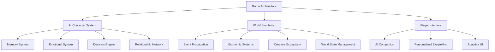

# AI-Driven Living World Game Architecture

## Overview
This document outlines the architecture for a React-based game featuring:
- Autonomous AI characters with complete life simulations
- Complex memory and learning systems
- Dynamic world events with butterfly effects
- Pokemon-style creature integration
- Player-driven narrative emergence

## Core Systems



## Implementation Phases

### Phase 1: Foundation (Week 1-2)
1. **Project Structure Setup**
   - Core AI systems directory
   - Game world simulation services
   - UI components library

2. **Base Character AI**
   - Memory system implementation
   - Emotional response framework
   - Basic decision making

3. **World Systems**
   - Event queue and propagation
   - Simple economic model

### Phase 2: Core Gameplay (Week 3-4)
1. **Advanced Character Systems**
   - Personality generation
   - Life goal hierarchies
   - Relationship networks

2. **World Dynamics**
   - Butterfly effect engine
   - Habitat simulation
   - Creature AI behaviors

3. **Player Integration**
   - Companion AI
   - Story generation
   - Adaptive interfaces

### Phase 3: Optimization (Week 5-6)
1. **Performance**
   - Distributed processing
   - Memory management
   - Load balancing

2. **Scalability**
   - World partitioning
   - LOD systems
   - Background processing

## Technical Specifications

### AI Character System
```javascript
class AICharacter {
  constructor(id, personality) {
    this.id = id;
    this.memories = new MemorySystem();
    this.emotions = new EmotionalSystem();
    this.goals = new GoalHierarchy();
    this.relationships = new RelationshipNetwork();
    this.worldModel = new PersonalWorldModel();
    this.decisionEngine = new AIDecisionEngine();
  }
}
```

### World Simulation
```javascript
class WorldSimulator {
  constructor() {
    this.characters = new Map();
    this.events = new EventQueue();
    this.economy = new EconomicSystem();
    this.ecosystems = new Map();
  }
}
```

### Player Interface
```javascript
class GameInterface {
  constructor(player) {
    this.player = player;
    this.companion = new AICompanion(player);
    this.storyTeller = new StoryGenerator();
    this.uiAdapter = new UIAdapter();
  }
}
```

## Next Steps
1. Implement core character AI systems
2. Build world simulation foundation
3. Develop player interface components
4. Integrate systems and test interactions