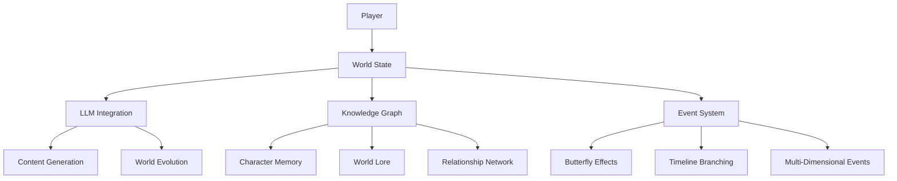

# Flexible World Simulation Architecture

## Core Principles
1. **Emergent World State** - The world evolves based on LLM decisions and user interactions
2. **Multi-Dimensional** - Supports alternate timelines, dimensions, mythologies
3. **Schema-Driven** - Uses JSON schemas for all game data representation
4. **LLM-Integrated** - Leverages knowledge databases and AI APIs for dynamic content
5. **BitLife Foundation** - Starts with normal world simulation that can diverge

## Architecture Overview



## Core Systems

### 1. Dynamic World State
```json
{
  "world_id": "dimension_alpha",
  "timeline": "normal",
  "properties": {
    "reality_stability": 0.85,
    "magic_level": 0.1,
    "tech_level": 0.7
  },
  "active_mythologies": ["christianity", "norse"],
  "possible_branches": [
    {
      "trigger": "nuclear_war",
      "timeline": "post_apocalyptic",
      "probability": 0.05
    }
  ]
}
```

### 2. Character System
```javascript
class Character {
  constructor() {
    this.memories = []; // JSON memory objects
    this.traits = {}; // Dynamic trait system
    this.relationships = new KnowledgeGraph();
    this.dimensionalLinks = []; // Connections to alt-reality versions
  }
  
  addMemory(event) {
    this.memories.push({
      id: generateId(),
      event: event,
      emotional_weight: calculateImpact(event),
      dimensional_signature: currentWorld.dimensionalId
    });
  }
}
```

### 3. LLM Integration Layer
```python
def generate_world_event(world_state, character):
    prompt = f"""
    World State: {world_state.to_json()}
    Character: {character.summary()}
    
    Generate 3 possible life events with branching consequences:
    1. Normal realistic event
    2. Slightly unusual event
    3. Reality-breaking event
    """
    
    response = llm_api.generate(
        prompt=prompt,
        schema=EVENT_SCHEMA,
        temperature=0.7
    )
    
    return validate_events(response)
```

### 4. Evolutionary Systems
```javascript
class WorldEvolution {
  constructor() {
    this.mutationRate = 0.1;
    this.dimensionalDrift = 0.01;
  }

  evolve(worldState) {
    // Apply gradual changes
    worldState.properties = this.mutateProperties(worldState.properties);
    
    // Check for timeline branches
    this.checkTimelineBranches(worldState);
    
    // Update dimensional links
    this.updateDimensionalConnections(worldState);
  }
}
```

## Implementation Phases

### Phase 1: Foundation
1. Implement core world state system
2. Create basic character memory/trait system
3. Set up LLM API integration

### Phase 2: Dynamic Systems
1. Build knowledge graph for relationships/lore
2. Implement event generation system
3. Add basic timeline branching

### Phase 3: Advanced Features
1. Develop multi-dimensional systems
2. Add mythology integration
3. Implement reality-altering mechanics

### Phase 4: Optimization
1. Add caching for frequent queries
2. Implement batch processing
3. Fine-tune LLM parameters

## Key Differences from Previous Plan
1. More focus on flexible world states rather than fixed systems
2. Emphasis on multi-dimensional possibilities
3. LLM integration at core rather than as add-on
4. Evolutionary systems drive world changes
5. BitLife-like foundation that can diverge

Would you like me to:
1. Create specific JSON schema examples
2. Detail the LLM integration approach
3. Focus on a particular system first
4. Make adjustments to this architecture