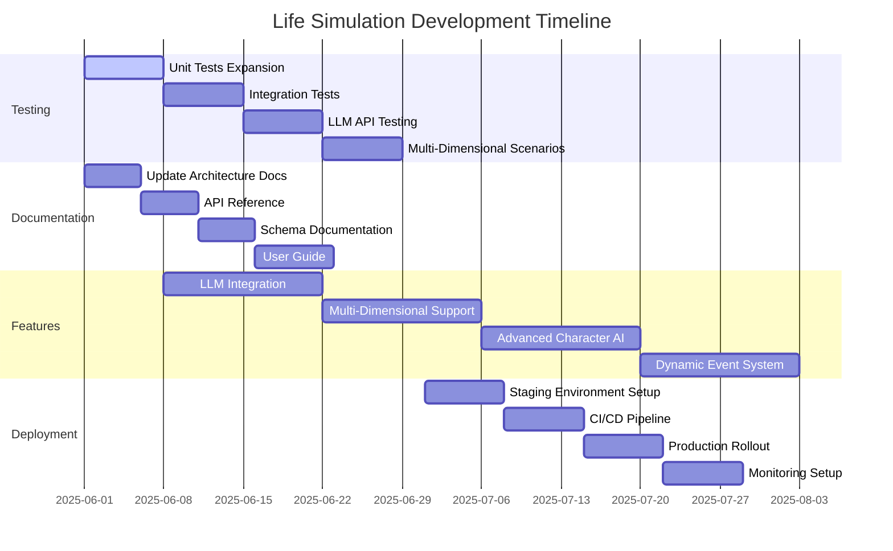

# Life Simulation Development Roadmap

## 1. Testing Plan

### Unit Tests Expansion
- Add tests for LLM service integration
- Test timeline branching scenarios
- Verify multi-dimensional state transitions
- Cover all world properties mutations

### Integration Tests
- Test world state + LLM service interaction
- Verify character behavior in different timelines
- Test event propagation across dimensions
- Validate UI state synchronization

### LLM API Testing
- Mock API responses for development
- Test error handling and fallbacks
- Validate schema compliance
- Performance testing with realistic loads

### Multi-Dimensional Scenarios
- Test dimension hopping mechanics
- Verify memory persistence across timelines
- Test stability calculations
- Validate UI theme transitions

## 2. Documentation Updates

### Architecture Docs
- Update with multi-dimensional design
- Document LLM integration points
- Add sequence diagrams for key flows
- Document schema evolution process

### API Reference
- LLM service API specs
- World state mutation API
- Event generation contracts
- Dimension management endpoints

### Schema Documentation
- Expand world schema with dimensions
- Document character relationship schemas
- Add event type definitions
- Versioning and migration guides

### User Guide
- Multi-dimensional gameplay
- Reality stability mechanics
- Character AI interactions
- Event interpretation guide

## 3. Feature Enhancements

### LLM Integration
- Real API connections
- Prompt engineering
- Response validation
- Caching layer

### Multi-Dimensional Support
- Dimension properties
- Cross-dimension memories
- Stability thresholds
- Visual transitions

### Advanced Character AI
- Personality systems
- Relationship networks
- Memory consolidation
- Goal-driven behavior

### Dynamic Event System
- Butterfly effect tracking
- Event consequence chains
- Player influence
- Timeline branching UI

## 4. Deployment Strategy

### Staging Environment
- Isolated test world
- LLM sandbox
- Performance monitoring
- Automated scenario testing

### CI/CD Pipeline
- Schema validation
- Test coverage checks
- Performance budgets
- Safe rollouts

### Production Rollout
- Phased feature enablement
- Player opt-in
- Monitoring dashboards
- Rollback procedures

### Monitoring Setup
- Reality stability alerts
- Event generation metrics
- Player interaction tracking
- Dimension activity

## 5. Timeline Estimates

- **Phase 1 (June 2025)**: Testing foundation + docs (4 weeks)
- **Phase 2 (July 2025)**: Core features + staging (4 weeks) 
- **Phase 3 (August 2025)**: Advanced features + rollout (4 weeks)
- **Phase 4 (September 2025)**: Optimization + monitoring (4 weeks)